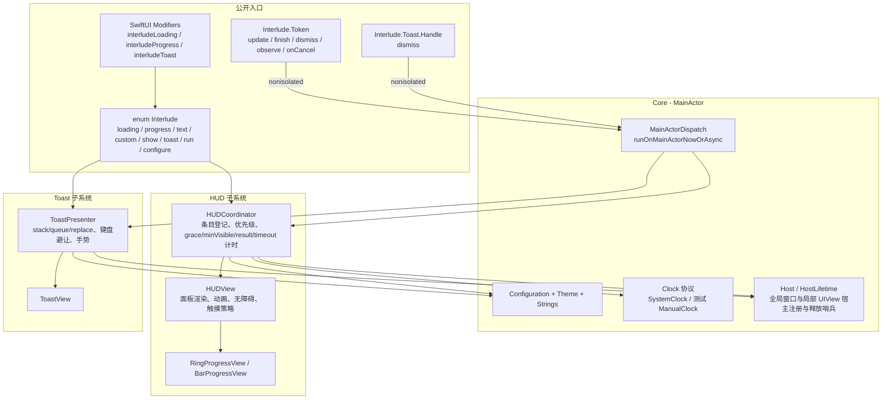
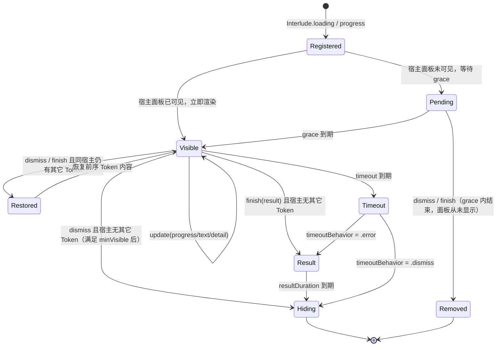
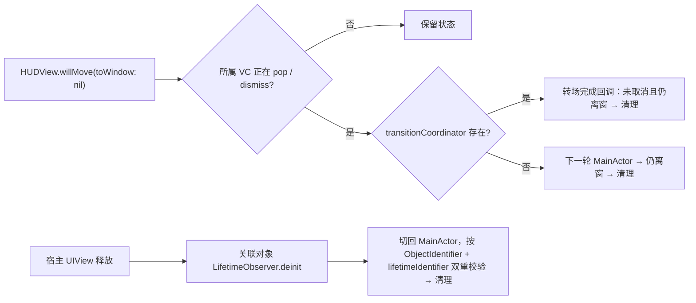

# Interlude 组件实现文档

> **文档性质**：Interlude 的实现规格与验收基准。代码实现、单元测试、Example 演示均以本文为对照源；实现与本文冲突时，先改文档再改代码。
> **适用范围**：iOS 15.0+，Swift 6.0 language mode，UIKit 渲染层 + SwiftUI 适配层，零第三方依赖。
> **仓库**：<https://github.com/KahnLi-lyc/Interlude>

---

## 目录

1. [定位与目标](#1-定位与目标)
2. [架构](#2-架构)
3. [公开 API 总览](#3-公开-api-总览)
4. [特性规格](#4-特性规格)
5. [与参考框架的能力对照](#5-与参考框架的能力对照)
6. [从 Nawa OverlayHUDKit 的迁移映射](#6-从-nawa-overlayhudkit-的迁移映射)
7. [测试矩阵](#7-测试矩阵)
8. [非目标](#8-非目标)

---

## 1. 定位与目标

Interlude 是一个统一的「状态反馈」库，覆盖 App 中两个稳定状态之间的所有过渡提示：

| 类别 | 场景 | 形态 |
| --- | --- | --- |
| Loading | 网络请求、页面刷新 | 不定进度指示器 + 可选文案 |
| Progress | 上传、下载、批处理 | 圆环 / 水平条 + 百分比 + 可选文案与详情 |
| Result | 请求结束 | 成功 / 失败 / 信息 / 自定义图片，短暂展示后自动隐藏 |
| Toast | 轻提示 | 顶部 / 中部 / 底部气泡，可带图标、标题、按钮 |

设计原则：

1. **Token 精确控制**：每次展示返回专属 Token，业务只能关闭自己发起的任务，不存在「关闭最近一个」的模糊接口。
2. **主线程安全但不强迫主线程**：展示入口 `@MainActor`；Token 的更新与结束 `nonisolated`，可在任意线程、`deinit` 中同步调用，组件内部切回 MainActor。
3. **可预测的时序**：grace 防闪烁、最短可见时间、结果自动隐藏、超时，全部由单调时钟驱动，可在测试中注入虚拟时钟。
4. **UIKit 为唯一渲染层**：SwiftUI 只做适配，不复制状态机。
5. **主题驱动**：视觉全部来自 `Interlude.Theme`，组件内无硬编码颜色。

---

## 2. 架构

### 2.1 组件关系



### 2.2 HUD Token 生命周期



### 2.3 局部宿主清理路径



### 2.4 线程模型

| 成员 | 隔离 | 说明 |
| --- | --- | --- |
| `Interlude.configure / theme / loading / progress / text / custom / show / toast / run` | `@MainActor` | 创建 UIKit 视图 |
| `Interlude.dismissAll / dismissAllToasts` | `nonisolated` | 内部切回 MainActor |
| `Token.update / finish / dismiss` | `nonisolated` | 只携带 `UUID` + 会话代次，Sendable |
| `Token.observe / onCancel / onDismiss / onTimeout` | `@MainActor` | 涉及非 Sendable 对象或闭包登记 |
| `Toast.Handle.dismiss` | `nonisolated` | 同 Token |
| `HUDCoordinator / ToastPresenter / HUDView / ToastView` | `@MainActor` | 全部状态与 UIKit |
| `MainActorDispatch.runOnMainActorNowOrAsync` | `nonisolated` | 唯一允许使用 `Thread.isMainThread` 与 `MainActor.assumeIsolated` 的地方 |

---

## 3. 公开 API 总览

```swift
// MARK: 配置（启动时一次）
Interlude.configure { config in
    config.windowProvider = { [weak window] in window }
    config.graceTime = 0.15
    config.minimumVisibleDuration = 0.35
    config.resultDuration = 1.2
    config.textDuration = 1.5
    config.timeout = 30                      // nil 表示不限
    config.timeoutBehavior = .error(message: nil)
    config.hapticsEnabled = true
    config.toast.position = .bottom
    config.toast.duration = .short
    config.toast.policy = .stack(maximum: 3)
    config.toast.isTapToDismissEnabled = true
    config.toast.isSwipeToDismissEnabled = true
    config.toast.avoidsKeyboard = true
    config.strings.loading = "加载中"        // 覆盖内置本地化
}
Interlude.theme = .automatic                 // .dark / .light / 自定义 Interlude.Theme

// MARK: HUD
let token = Interlude.loading("Loading…")                                  // 全局
let token = Interlude.loading("Refreshing…", on: view, interaction: .passthrough)
let token = Interlude.progress("Uploading…", value: 0, style: .ring)       // .bar
token.update(progress: 0.4)
token.update(text: "Almost done")
token.update(detail: "3 / 10")
token.observe(progress)                                                    // Foundation.Progress
token.onCancel { uploader.cancel() }                                        // 显示取消按钮
token.onDismiss { … }
token.finish(.success("Saved"))
token.finish(.error("Failed"))
token.finish(.info("Offline"))
token.finish(.image(UIImage(named: "party")!, "Done"))
token.dismiss()

Interlude.text("Copied to clipboard")                                       // 文本 HUD，自动隐藏
Interlude.custom(myLottieView, text: "Processing…")
Interlude.show(.success("Saved"))                                           // 直接闪一个结果
Interlude.dismissAll()                                                      // 会话级清理

// MARK: async 语法糖
let profile = try await Interlude.run("Loading…") { try await api.fetchProfile() }
try await Interlude.run("Saving…", success: "Saved") { try await api.save() }
try await Interlude.run("Uploading…", style: .bar) { progress in
    try await uploader.upload(data, progress: progress)
}

// MARK: Toast
Interlude.toast("Copied")
Interlude.toast("Uploaded", icon: .success, position: .top, duration: .short)
Interlude.toast("New message", title: "Alice", icon: .image(avatar),
                action: .init(title: "Reply") { openChat() })
let handle = Interlude.toast("Syncing…", duration: .persistent)
handle.dismiss()
Interlude.toast(custom: bannerView, position: .top)
Interlude.dismissAllToasts()

// MARK: SwiftUI
ContentView()
    .interludeLoading(isPresented: $viewModel.isLoading, text: "Loading…")
    .interludeProgress($viewModel.uploadProgress, text: "Uploading…")
    .interludeToast($viewModel.toast)

DetailView()
    .interludeHost()                                                        // 让内部修饰符走局部宿主
```

### 3.1 公开类型清单

| 类型 | 种类 | 说明 |
| --- | --- | --- |
| `Interlude` | `enum` 命名空间 | 全部静态入口 |
| `Interlude.Configuration` | `struct, Sendable` | 时序、行为、Toast 默认值、文案覆盖 |
| `Interlude.Configuration.Toast` | `struct, Sendable` | Toast 默认位置 / 时长 / 策略 / 手势 / 键盘避让 |
| `Interlude.Strings` | `struct, Sendable` | 可覆盖的内置文案 |
| `Interlude.Theme` | `struct, Sendable` | 全部视觉参数，预置 `.dark / .light / .automatic` |
| `Interlude.Theme.Background` | `enum` | `.blur(UIBlurEffect.Style)` / `.solid(UIColor)` |
| `Interlude.Theme.Toast` | `struct` | Toast 视觉参数 |
| `Interlude.Animation` | `enum` | `.fade / .zoom / .zoomIn / .zoomOut / .none` |
| `Interlude.Interaction` | `enum` | `.blocking / .passthrough` |
| `Interlude.ProgressStyle` | `enum` | `.ring / .bar` |
| `Interlude.ProgressFill` | `enum` | `.solid / .gradient` |
| `Interlude.Result` | `enum, Sendable` | `.success(String?) / .error(String?) / .info(String?) / .image(UIImage, String?)` |
| `Interlude.TimeoutBehavior` | `enum, Sendable` | `.dismiss / .error(message: String?)` |
| `Interlude.Token` | `final class, Sendable` | HUD 任务句柄 |
| `Interlude.Toast` | `struct` | Toast 内容模型 |
| `Interlude.Toast.Position` | `enum` | `.top / .center / .bottom / .point(CGPoint)` |
| `Interlude.Toast.Animation` | `enum` | `.automatic / .slide / .fade / .zoom / .none` |
| `Interlude.Toast.Duration` | `enum` | `.short(2s) / .long(3.5s) / .seconds(TimeInterval) / .persistent` |
| `Interlude.Toast.Icon` | `enum` | `.none / .success / .error / .info / .warning / .system(String) / .image(UIImage)` |
| `Interlude.Toast.Action` | `struct` | 按钮标题 + MainActor 回调 |
| `Interlude.Toast.Policy` | `enum` | `.stack(maximum: Int) / .queue / .replace` |
| `Interlude.Toast.Handle` | `final class, Sendable` | 单条 Toast 句柄 |
| `View.interludeLoading / interludeProgress / interludeToast / interludeHost` | SwiftUI 扩展 | 适配层 |

命名规则：公开类型全部嵌套在 `Interlude` 下，不加 `HUD` / `Overlay` 前缀；内部类型（`HUDCoordinator`、`HUDView`、`ToastPresenter` 等）不公开。

---

## 4. 特性规格

每节结构固定：**行为** → **API** → **默认值** → **边界** → **验收标准**（编号 `AC-xx-n`，与 §7 测试矩阵一一对应）。

### 4.1 配置与时序

**行为**

- `graceTime`：Token 登记后，若宿主面板当前不可见，等待 graceTime 后再显示；期间被 dismiss/finish 则面板从不出现。
- `minimumVisibleDuration`：面板一旦可见，至少保持该时长再隐藏；在此期间 dismiss 会延后执行。
- `resultDuration`：结果状态展示时长，到期自动淡出。
- `textDuration`：`Interlude.text` 默认展示时长。
- `timeout`：Token 登记后经过该时长仍未结束，按 `timeoutBehavior` 自动处理。
- 所有时序基于 `ProcessInfo.systemUptime` 单调时钟，不受系统时间调整影响。

**API**

```swift
@MainActor static func configure(_ update: (inout Configuration) -> Void)
@MainActor static var configuration: Configuration { get }
```

**默认值**

| 参数 | 默认 |
| --- | ---: |
| `graceTime` | 0.15 s |
| `minimumVisibleDuration` | 0.35 s |
| `resultDuration` | 1.2 s |
| `textDuration` | 1.5 s |
| `timeout` | `nil`（不限） |
| `timeoutBehavior` | `.error(message: nil)` → 使用本地化「请求超时」 |
| `hapticsEnabled` | `true` |

**边界**

- 负数、NaN、无穷时长规范为 0。
- `configure` 在有活跃 HUD 时调用，立即用新窗口重新挂载全局面板，不打断计时。
- `windowProvider` 未配置时，全局展示直接返回失效 Token（不 crash，Debug 下 `assertionFailure`）。

**验收标准**

- AC-01-1 grace 内 dismiss，面板 `renderedMode` 始终为 `.pending → .hidden`，从未 `.loading`。
- AC-01-2 grace 到期后面板 `renderedMode == .loading`。
- AC-01-3 面板可见 0.1 s 后 dismiss，实际隐藏发生在 `minimumVisibleDuration` 到期后。
- AC-01-4 结果展示到 `resultDuration` 后自动 `.hidden`。
- AC-01-5 传入负数 / NaN 时序等价于 0。
- AC-01-6 未配置 windowProvider 的全局展示返回的 Token 调用任何方法不 crash。

### 4.2 宿主：全局窗口与局部 UIView

**行为**

- `on: nil` 使用 `windowProvider` 返回的窗口；`on: view` 把覆盖层挂到该视图并铺满 bounds。
- 每个宿主拥有独立状态、独立面板；不同宿主可同时显示。
- 全局面板实例复用；局部面板随宿主状态释放。
- 局部宿主的清理见 §2.3：页面 pop / dismiss 完成后立即清理；宿主 UIView 释放时兜底清理；交互式返回取消不清理；`removeFromSuperview` 但仍被持有不清理。

**API**：所有展示方法的 `on host: UIView? = nil` 参数。

**边界**

- 同一 UIView 的 `ObjectIdentifier` 在释放后被新对象复用：依靠 `lifetimeIdentifier` 拒绝旧释放回调。
- 宿主已释放但 Token 仍被调用：静默忽略。

**验收标准**

- AC-02-1 全局与局部同时 loading，两个面板均 `.loading`。
- AC-02-2 pop 成功后局部状态数为 0，旧 Token 再调用无效果。
- AC-02-3 push 到下一页再返回，局部 Token 仍有效。
- AC-02-4 交互式 pop 取消后，局部面板仍可见。
- AC-02-5 宿主 UIView 释放后，`localHostCount == 0`。
- AC-02-6 宿主 `removeFromSuperview` 但仍被强引用，状态保留。

### 4.3 Token 与多任务

**行为**

- 同一宿主可登记多个 Token，只显示一个面板，内容取**最后创建**的活跃 Token。
- 当前 Token 结束后若仍有其它 Token，立即恢复前序 Token 的模式 / 文案 / 进度 / 详情。
- 更新非当前 Token 只保存状态，不抢占显示。
- `finish(result)` 仅在宿主没有其它 Token 时展示结果；否则等价于 `dismiss()` 并恢复前序。
- Token 无 `deinit` 自动关闭；业务必须显式结束。
- `dismissAll()` 推进会话代次，旧 Token 全部失效。

**API**

```swift
public final class Token: Sendable {
    nonisolated func update(progress: Double)
    nonisolated func update(text: String?)
    nonisolated func update(detail: String?)
    nonisolated func dismiss()
    nonisolated func finish(_ result: Result)
    @MainActor var isActive: Bool { get }
    @MainActor @discardableResult func onDismiss(_ handler: @escaping @MainActor () -> Void) -> Token
}
```

**边界**

- 对已结束或失效 Token 的任何调用静默忽略。
- 进度 NaN → 0，超出 `0...1` 截断。
- `update(progress:)` 作用于 `.loading` Token 时自动切换为 `.progress(.ring)`。

**验收标准**

- AC-03-1 A、B 先后登记，面板显示 B；B dismiss 后面板恢复 A 的文案与模式。
- AC-03-2 更新非当前 Token A 的文案，面板仍显示 B。
- AC-03-3 A、B 同在时 B `finish(.success)` 不展示结果，面板回到 A。
- AC-03-4 `dismissAll()` 后旧 Token `finish` 不再显示任何面板。
- AC-03-5 进度 -1 → 0，2 → 1，NaN → 0。
- AC-03-6 `onDismiss` 在面板隐藏完成后恰好调用一次。

### 4.4 交互策略

**行为**

- `.blocking`：覆盖层从登记那一刻（含 grace 透明期）拦截全部触摸；VoiceOver 视为模态区域。
- `.passthrough`：覆盖层不参与命中测试；VoiceOver 非模态。
- 结果状态、`text` HUD、Toast 始终 passthrough。

**默认值**：`loading / progress / custom` 默认 `.blocking`；`text / show(result)` 固定 passthrough。

**验收标准**

- AC-04-1 blocking 在 grace 期间 `isUserInteractionEnabled == true` 且面板 alpha 为 0。
- AC-04-2 passthrough 的覆盖层 `hitTest` 返回 nil。
- AC-04-3 finish 后结果面板 `isUserInteractionEnabled == false`。

### 4.5 模式

| 模式 | 视觉 | 入口 |
| --- | --- | --- |
| `.loading` | 系统活动指示器 + 文案 + 详情 | `Interlude.loading` |
| `.progress(.ring)` | 圆环 + 中心整数百分比 + 文案 + 详情 | `Interlude.progress(style: .ring)` |
| `.progress(.bar)` | 水平进度条 + 右侧百分比 + 文案 + 详情 | `Interlude.progress(style: .bar)` |
| `.text` | 仅文案 + 详情，无指示器 | `Interlude.text` |
| `.custom(UIView)` | 调用方视图 + 文案 + 详情 | `Interlude.custom` |

**行为**

- 百分比按当前 Locale 格式化（`NumberFormatter.percent`，0 位小数）。
- 圆环中心百分比完整可见：字号约 15pt（Dynamic Type 上限 18），标签左右内缩 `2 × ringLineWidth`，文字矩形四角落在描边内圆里。
- 进度填充：`ProgressFill.solid`（默认）使用 `indicatorColor`；`.gradient` 使用 `progressGradient`（≥2 色）或不透明同色系兜底 `[.systemCyan, infoColor]`。`Interlude.progress(..., fill:)` 可按次覆盖。
- 圆环渐变随进度铺展：色带落在 `[0, progress]`，末色重复到整圈；`progress == 1` 时整环收成末色，12 点方向不出现色缝。
- 进度变化使用 0.15 s `strokeEnd` / 宽度动画，Reduce Motion 关闭动画。
- `.custom` 视图尺寸取其 `intrinsicContentSize`，无内在尺寸时使用主题 `indicatorSize`。
- `detail` 使用次要颜色与更小字体，nil / 空串隐藏。

**验收标准**

- AC-05-1 `progress(value: 0.5)` 面板 `displayedPercentage == "50%"`（en_US）。
- AC-05-2 `.bar` 模式 `renderedMode == .progress(0.5, .bar)`。
- AC-05-3 `text` HUD 到 `textDuration` 后自动隐藏。
- AC-05-4 `custom` 视图被添加为面板子视图且居中。
- AC-05-5 `update(detail:)` 后面板 `renderedDetail` 更新；传空串后隐藏。
- AC-05-6 默认 80pt 圆环真实布局为 80 × 80，`progress == 1` 时中心 `100%` 四角全部落在描边内圆里。

### 4.6 结果与 Haptics

**行为**

- `.success`：主题 `successColor` 的 `checkmark.circle.fill`；触发 `.success` 触感。
- `.error`：主题 `errorColor` 的 `xmark.circle.fill`；触发 `.error` 触感。
- `.info`：主题 `infoColor` 的 `info.circle.fill`；触发 `.warning` 触感。
- `.image(UIImage, String?)`：调用方图片，`renderingMode` 为 template 时按 `foregroundColor` 着色；无触感。
- `Interlude.show(_ result:)` 直接展示结果，等价于「登记 + 立即 finish」。
- `hapticsEnabled == false` 时不触发任何触感。

**验收标准**

- AC-06-1 `finish(.success)` 后 `renderedMode == .success`。
- AC-06-2 `finish(.info)` 后 `renderedMode == .info`。
- AC-06-3 `finish(.image)` 后 `renderedMode == .image` 且 `resultImage === 传入图片`。
- AC-06-4 `show(.error("x"))` 不经 grace，面板立即可见并在 `resultDuration` 后隐藏。
- AC-06-5 `hapticsEnabled == false` 时触感生成器未被调用（通过可注入的 `HapticsPlayer` 协议验证）。

### 4.7 Foundation.Progress 绑定

**行为**

- `token.observe(progress)` 通过 KVO 观察 `fractionCompleted`，每次变化调用 `update(progress:)`；同时把 `localizedAdditionalDescription` 非空时写入 `detail`（可通过参数关闭）。
- Token 结束或失效时自动移除观察。
- `progress.isCancellable` 且设置了 `onCancel` 时，取消按钮同时调用 `progress.cancel()`。

**API**

```swift
@MainActor @discardableResult
func observe(_ progress: Progress, updatesDetail: Bool = true) -> Token
```

**验收标准**

- AC-07-1 `progress.completedUnitCount` 变更后面板进度同步。
- AC-07-2 Token dismiss 后再改 Progress，不触发任何更新。

### 4.8 取消按钮

**行为**

- `onCancel(title:handler:)` 后面板底部出现按钮，点击后：调用 handler → 该 Token `dismiss()`。
- 按钮存在时覆盖层必须为 `.blocking`（否则按钮不可点），若原策略为 passthrough 自动升级。
- 未设置 `onCancel` 的 Token 不显示按钮。多 Token 时按钮随当前显示 Token 切换。

**API**

```swift
@MainActor @discardableResult
func onCancel(title: String? = nil, _ handler: @escaping @MainActor () -> Void) -> Token
```

**默认值**：`title == nil` 使用本地化「取消」。

**验收标准**

- AC-08-1 设置 `onCancel` 后面板 `isCancelButtonVisible == true`。
- AC-08-2 触发按钮后 handler 调用一次且 Token `isActive == false`。
- AC-08-3 passthrough Token 设置 `onCancel` 后 `isUserInteractionEnabled == true`。

### 4.9 超时

**行为**

- 每个 Token 可独立指定 `timeout:`，未指定时使用 `Configuration.timeout`；两者皆 nil 不超时。
- 到期后：先调用 `onTimeout` handler（如有），再按 `timeoutBehavior` 执行 `finish(.error(message))` 或 `dismiss()`。
- 已结束的 Token 不触发超时。

**API**

```swift
@MainActor @discardableResult
func onTimeout(_ handler: @escaping @MainActor () -> Void) -> Token
```

**验收标准**

- AC-09-1 `timeout: 1` 到期后 `renderedMode == .error`，`renderedText` 为本地化超时文案。
- AC-09-2 `timeoutBehavior = .dismiss` 时到期后 `.hidden`。
- AC-09-3 到期前 dismiss，`onTimeout` 不调用。

### 4.10 主题

**行为**

- `Interlude.theme` 为全局主题；展示方法的 `theme:` 参数覆盖单次。
- 主题修改后，已显示面板在下一次渲染时应用（不强制重绘）。
- `.automatic` 使用动态颜色，随 Light / Dark 模式切换。
- Reduce Transparency 开启时，`.blur` 背景降级为 `reduceTransparencyColor` 纯色。
- `progressFill` 默认 `.solid`；`.gradient` 时圆环圆锥渐变、进度条轴向渐变。色带优先 `progressGradient`（≥2 色），否则不透明同色系兜底 `[.systemCyan, infoColor]`；两端不带 alpha，避免透出轨道发暗。图层颜色按视图自身 `traitCollection` 解析。
- `Interlude.progress(..., fill:)` 写入该次主题副本；`nil` 跟随 `Theme.progressFill`。
- 加载指示器使用 `.large` 系统菊花，非 Reduce Motion 时放大到 `indicatorSize * 0.75`；结果 SF Symbol 字重 `.semibold`，点大小为 `indicatorSize * 0.85`。菊花与结果图只居中、不与指示器容器等宽（菊花 hugging 750 会与容器宽度打平，把圆环压窄）。
- 内容比 `minimumSize` 矮时（仅指示器），内容在面板内垂直居中而非被拉伸。

**Theme 字段**

| 字段 | 类型 | `.dark` 默认 |
| --- | --- | --- |
| `background` | `Background` | `.blur(.systemChromeMaterialDark)` |
| `reduceTransparencyColor` | `UIColor` | `UIColor(white: 0.08, alpha: 0.96)` |
| `dimmingColor` | `UIColor` | `black 12%` |
| `foregroundColor` | `UIColor` | `.white` |
| `secondaryForegroundColor` | `UIColor` | `white 70%` |
| `indicatorColor` | `UIColor` | `.white` |
| `trackColor` | `UIColor` | `white 25%` |
| `successColor / errorColor / infoColor` | `UIColor` | `.systemGreen / .systemRed / .systemBlue` |
| `cornerRadius` | `CGFloat` | 16 |
| `textFont` | `UIFont` | `.preferredFont(.subheadline)` |
| `detailFont` | `UIFont` | `.preferredFont(.footnote)` |
| `buttonFont` | `UIFont` | `.preferredFont(.subheadline, weight: .semibold)` |
| `contentInsets` | `NSDirectionalEdgeInsets` | `(20, 24, 20, 24)` |
| `spacing` | `CGFloat` | 12 |
| `indicatorSize` | `CGFloat` | 80 |
| `ringLineWidth` | `CGFloat` | 8 |
| `minimumSize` | `CGSize` | `128 × 128` |
| `maximumWidth` | `CGFloat` | 260 |
| `offset` | `UIOffset` | `.zero` |
| `animation` | `Animation` | `.fade` |
| `animationDuration` | `TimeInterval` | 0.15 |
| `progressFill` | `ProgressFill` | `.solid` |
| `progressGradient` | `[UIColor]` | `[]`（`.gradient` 且为空时用同色系兜底） |
| `toast` | `Theme.Toast` | 见下 |

`Theme.Toast` 字段：`background`（`.solid(black 80%)`）、`foregroundColor`、`secondaryForegroundColor`、`cornerRadius`（10）、`messageFont`、`titleFont`、`contentInsets`（`(10, 14, 10, 14)`）、`maximumWidthRatio`（0.8）、`edgeInset`（16，距屏幕边缘 / 安全区）、`spacing`（8）、`shadow`（可选 `Shadow` 值类型）、`iconSize`（20）、`actionTintColor`、`animation`（`.automatic`）。

`.light` 为反色版本：`.blur(.systemChromeMaterialLight)`、深色前景。`.automatic` 各字段使用 `UIColor { traits in … }` 动态色，背景 `.blur(.systemChromeMaterial)`。

**验收标准**

- AC-10-1 设置 `theme.cornerRadius = 20` 后新面板 `panel.layer.cornerRadius == 20`。
- AC-10-2 单次 `theme:` 覆盖不影响 `Interlude.theme`。
- AC-10-3 Reduce Transparency 开启时 `panel.effect == nil`。
- AC-10-4 默认 `indicatorSize == 80`，圆环真实布局尺寸为 80 × 80；单次覆盖为 96 后真实尺寸跟随。
- AC-10-5 `fill: .gradient`（或 `theme.progressFill = .gradient`）时圆环 / 进度条使用渐变；兜底色带每个颜色 alpha 为 1，圆环 `locations` 在 50% 为 `[0, 0.5, 1]`、100% 为 `[0, 0, 1]`；圆环起点圆帽使用渐变首色，不得跨 conic 接缝采到末色。
- AC-10-6 默认 `.solid` 使用实心 `indicatorColor`，即使 `progressGradient` 有颜色。

### 4.11 动画

| 类型 | 出现 | 消失 |
| --- | --- | --- |
| `.fade` | alpha 0→1 | alpha 1→0 |
| `.zoom` | alpha + scale 1.3→1 | alpha + scale 1→0.7 |
| `.zoomIn` | scale 0.7→1 | scale 1→0.7 |
| `.zoomOut` | scale 1.3→1 | scale 1→1.3 |
| `.none` | 立即 | 立即 |

Reduce Motion 开启时 HUD 与 Toast 全部退化为 `.none`。

`Toast.Animation`（`theme.toast.animation`，默认 `.automatic`；单条 Toast 可覆盖）：

| 类型 | 出现 | 消失 |
| --- | --- | --- |
| `.automatic` | top / bottom 按 `.slide`；center / point 按 `.zoom` | 同出现方向反向 |
| `.slide` | 从对应边缘外滑入并淡入；center / point 为 fade + 上浮 8pt | 沿同方向滑出并淡出 |
| `.fade` | alpha 0→1 | alpha 1→0 |
| `.zoom` | alpha + scale 0.85→1 | alpha + scale 1→0.85 |
| `.none` | 立即 | 立即 |

布局在动画开始前完成，出入场只动画 `alpha` 与 `transform`，避免从图层原点飞入。

**验收标准**

- AC-11-1 Reduce Motion 下 reveal 完成后立即 `panel.alpha == 1`，无动画。
- AC-11-2 `.none` 下 hide 的 completion 同步调用。

### 4.12 无障碍

- 面板为单一无障碍元素；指示器 / 圆环 / 图标为装饰元素。
- loading：`accessibilityLabel` = 文案或本地化「加载中」，`traits = .staticText`，首次或文案变化时播报。
- progress：`traits = .updatesFrequently`，`accessibilityValue` = 百分比，不逐次播报。
- 结果：播报一次文案或本地化默认。
- 取消按钮为独立可聚焦元素。
- Toast：整体为一个元素，`label` = 标题 + 正文；有 action 时按钮独立可聚焦；出现时 `.announcement`。
- Dynamic Type：全部文案使用 `adjustsFontForContentSizeCategory`。
- blocking 时 `accessibilityViewIsModal = true`。

**验收标准**

- AC-12-1 loading 无文案时 `accessibilityLabel == 本地化 loading`。
- AC-12-2 progress `accessibilityValue == "50%"`。
- AC-12-3 blocking 面板 `accessibilityViewIsModal == true`，passthrough 为 false。

### 4.13 本地化

内置键（`Sources/Interlude/Resources/*.lproj/Localizable.strings`，通过 `Bundle.module` 读取）：

| 键 | en |
| --- | --- |
| `interlude.loading` | Loading |
| `interlude.success` | Success |
| `interlude.error` | Error |
| `interlude.info` | Information |
| `interlude.timeout` | Request timed out |
| `interlude.cancel` | Cancel |
| `interlude.toast.dismiss_hint` | Double tap to dismiss |

语言：en、zh-Hans、zh-Hant、ja、ko、es、ar、tr、id。

覆盖：`Configuration.strings` 的对应字段非 nil 时优先。

**验收标准**

- AC-13-1 `strings.loading = "自定义"` 后无文案 loading 的 `accessibilityLabel == "自定义"`。
- AC-13-2 9 个 lproj 键集合完全一致（脚本校验）。

### 4.14 Toast

**行为**

- 位置：`.top` 贴安全区顶部 + `edgeInset`；`.bottom` 贴安全区底部 + `edgeInset`，键盘弹出时上移到键盘之上；`.center` 居中；`.point` 以中心点定位。
- 动画：`Toast.Animation`，默认 `.automatic`（top / bottom 从对应边缘滑入，center / point 缩放）；单条可覆盖；Reduce Motion 退化为 `.none`。
- 内容：`icon`（左）、`title`（粗体，可选）、`message`（必填）、`action` 按钮（右，可选）。
- 策略（按宿主 + 位置分组）：
  - `.stack(maximum:)`：同位置多条同时显示，新条目按方向追加（top 向下、bottom 向上），超出 maximum 时最早一条立即移除。
  - `.queue`：同位置一次一条，后来者排队，前一条消失后再显示。
  - `.replace`：新条目立即替换当前条目，队列清空。
- 时长：`.short` 2 s、`.long` 3.5 s、`.seconds(x)`、`.persistent` 不自动消失（必须通过 Handle 或 `dismissAllToasts` 关闭）。
- 手势：点按整体 → 关闭并 `completion(didTap: true)`；沿位置方向滑动（top 上滑、bottom 下滑、center 任意）→ 关闭；action 按钮点击 → 调用 handler 并关闭，`didTap == true`。
- 自动消失 → `completion(didTap: false)`。
- Toast 图层位于 HUD 覆盖层之上，二者互不阻塞；HUD blocking 不影响 Toast 可点击。
- 局部宿主 Toast（`on: view`）跟随宿主生命周期清理（复用 §2.3 机制）。

**API**

```swift
@MainActor @discardableResult
static func toast(_ message: String, title: String? = nil, icon: Toast.Icon = .none,
                  position: Toast.Position? = nil, duration: Toast.Duration? = nil,
                  animation: Toast.Animation? = nil, action: Toast.Action? = nil,
                  theme: Theme? = nil, on host: UIView? = nil,
                  completion: (@MainActor (_ didTap: Bool) -> Void)? = nil) -> Toast.Handle

@MainActor @discardableResult
static func toast(_ toast: Toast, on host: UIView? = nil) -> Toast.Handle

@MainActor @discardableResult
static func toast(custom view: UIView, position: Toast.Position? = nil,
                  duration: Toast.Duration? = nil, animation: Toast.Animation? = nil,
                  on host: UIView? = nil,
                  completion: (@MainActor (Bool) -> Void)? = nil) -> Toast.Handle

nonisolated static func dismissAllToasts()

public final class Toast.Handle: Sendable {
    nonisolated func dismiss()
    @MainActor var isVisible: Bool { get }
}
```

**默认值**：`position = .bottom`、`duration = .short`、`policy = .stack(maximum: 3)`、`isTapToDismissEnabled = true`、`isSwipeToDismissEnabled = true`、`avoidsKeyboard = true`。

**边界**

- 空 `message` 且无 `title` / `icon` / 自定义视图：忽略并返回失效 Handle。
- 宿主宽度极窄时 `maximumWidthRatio` 保证不超出。
- 键盘避让仅对全局窗口宿主的 `.bottom` 生效。

**验收标准**

- AC-14-1 `.stack(maximum: 2)` 连发 3 条，可见 2 条且首条已移除。
- AC-14-2 `.queue` 连发 2 条，第 1 条消失后第 2 条才可见。
- AC-14-3 `.replace` 连发 2 条，只剩第 2 条。
- AC-14-4 `.persistent` 到 10 s 仍可见；`handle.dismiss()` 后消失。
- AC-14-5 点按后 `completion(true)`；自动消失 `completion(false)`。
- AC-14-6 action 按钮触发 handler 一次并关闭。
- AC-14-7 模拟 `keyboardWillChangeFrame` 后 bottom Toast 的 `frame.maxY <= keyboardFrame.minY - edgeInset`。
- AC-14-8 HUD blocking 时 Toast 仍能接收点按。
- AC-14-9 `dismissAllToasts()` 后可见数为 0 且队列清空。
- AC-14-10 空内容 Toast 不创建视图。
- AC-14-11 `.automatic` 在 `.bottom` 解析为 slide（纯平移 ty > 0），在 `.center` 解析为 zoom（等比缩放 < 1）。
- AC-14-12 `.none`（及 Reduce Motion）下 present 后立即 `alpha == 1`、`transform == .identity`、`frame.size != .zero`。

### 4.15 async 语法糖

**行为**

- `run` 在开始时登记 loading / progress Token，`operation` 正常返回 → `success` 非 nil 则 `finish(.success)` 否则 `dismiss()`；抛 `CancellationError` → `dismiss()`；抛其它错误 → `finish(.error(failure(error)))`，再重新抛出。
- `run(style:)` 版本把 `Progress(totalUnitCount: 100)` 交给 operation，内部 `observe`。
- Token 的取消按钮（`cancellable: true`）取消外层 `Task`。

**API**

```swift
@MainActor
static func run<T: Sendable>(
    _ text: String? = nil, on host: UIView? = nil, interaction: Interaction = .blocking,
    success: String? = nil, failure: @escaping @Sendable (Error) -> String? = { $0.localizedDescription },
    cancellable: Bool = false, timeout: TimeInterval? = nil,
    operation: @Sendable () async throws -> T
) async throws -> T

@MainActor
static func run<T: Sendable>(
    _ text: String? = nil, style: ProgressStyle = .ring, on host: UIView? = nil, …,
    operation: @Sendable (Progress) async throws -> T
) async throws -> T
```

**验收标准**

- AC-15-1 operation 成功且 `success == nil` → 面板 `.hidden`，返回值透传。
- AC-15-2 operation 抛错 → `.error` 且错误重新抛出。
- AC-15-3 operation 抛 `CancellationError` → `.hidden`，无结果。
- AC-15-4 `cancellable: true` 点击取消后 operation 收到取消。

### 4.16 SwiftUI 适配

**行为**

- `interludeLoading(isPresented:text:interaction:)`：`isPresented` 变 true 登记 Token，变 false 或视图消失时 `dismiss()`。
- `interludeProgress(_ value: Binding<Double?>, style:fill:text:)`：非 nil 时展示并同步进度，nil 时 dismiss。
- `interludeToast(_ item: Binding<Toast?>)`：非 nil 时展示并在消失后置回 nil。
- `interludeHost()`：在视图背后放置透明 `UIViewRepresentable`，把其 UIView 通过 Environment 提供给内部修饰符，使其走局部宿主；未使用时内部修饰符走全局窗口。

**验收标准**

- AC-16-1 `isPresented` true→false 后 `Interlude.isShowingHUD == false`。
- AC-16-2 使用 `interludeHost()` 后局部宿主数量为 1。
- AC-16-3 视图被移出层级时 Token 自动 dismiss。

### 4.17 会话级清理

- `Interlude.dismissAll()` 立即移除所有 HUD（全局 + 局部）、取消全部计时，推进会话代次使旧 Token 失效；**不**影响 Toast。
- `Interlude.dismissAllToasts()` 清空全部 Toast 与队列；**不**影响 HUD。
- 两者都是 `nonisolated`。

**验收标准**

- AC-17-1 `dismissAll()` 后 `isShowingHUD == false` 且 Toast 仍可见。
- AC-17-2 `dismissAllToasts()` 后 HUD 仍可见。

---

## 5. 与参考框架的能力对照

| 能力 | MBProgressHUD | SVProgressHUD | Toast-Swift | Interlude |
| --- | --- | --- | --- | --- |
| 局部宿主 | ✅ `showHUDAddedTo:` | ⚠️ 单一 `containerView` | ✅ `view.makeToast` | ✅ `on: view`，多宿主并存 |
| 全局窗口 | ❌ | ✅ | ❌ | ✅ |
| 精确关闭单任务 | ⚠️ 需持有实例 | ❌ `popActivity` 计数 | ⚠️ `hideToast(view)` | ✅ Token |
| 多任务恢复前序 | ❌ | ❌ | ❌ | ✅ |
| grace / minShow | ✅ | ✅ grace / minDismiss | ❌ | ✅ |
| 超时 | ❌ | ⚠️ `maximumDismissTimeInterval` 只作用于结果 | ❌ | ✅ 任务级 timeout + behavior |
| 不定进度 | ✅ | ✅ | ✅ activity | ✅ |
| 圆环进度 | ✅ annular | ✅ | ❌ | ✅ |
| 水平进度条 | ✅ | ❌ | ❌ | ✅ |
| 文本 HUD | ✅ text mode | ⚠️ 需传 status | ✅ | ✅ |
| 自定义视图 | ✅ customView | ❌ | ✅ showToast(view) | ✅ custom + toast(custom:) |
| 第二行详情 | ✅ detailsLabel | ❌ | ✅ title | ✅ detail |
| 成功 / 失败 / 信息 | ❌ 需自定义 | ✅ | ❌ | ✅ + image |
| NSProgress 绑定 | ✅ | ❌ | ❌ | ✅ |
| 取消按钮 | ✅ button | ❌ | ❌ | ✅ onCancel |
| 主题 | ⚠️ appearance | ✅ style + 大量 setter | ✅ ToastStyle | ✅ Theme 值类型 + 单次覆盖 |
| 动画类型 | ✅ fade / zoom | ✅ flat / native | ⚠️ fade | ✅ fade / zoom / zoomIn / zoomOut |
| 触感 | ❌ | ✅ | ❌ | ✅ |
| 遮罩 / 拦截 | ✅ backgroundView | ✅ maskType | ❌ | ✅ blocking / passthrough |
| Toast 位置 | ❌ | ❌ | ✅ top / center / bottom / point | ✅ |
| Toast 队列 | ❌ | ❌ | ✅ queue | ✅ stack / queue / replace |
| Toast 手势关闭 | ❌ | ✅ tap 通知 | ✅ tap | ✅ tap + swipe |
| Toast action 按钮 | ❌ | ❌ | ❌ | ✅ |
| 键盘避让 | ❌ | ❌ | ❌ | ✅ |
| 无障碍 | ⚠️ | ⚠️ | ⚠️ | ✅ VoiceOver / Dynamic Type / Reduce Motion / Reduce Transparency |
| 本地化默认文案 | ❌ | ❌ | ❌ | ✅ 9 语言 + 覆盖 |
| Swift Concurrency | ❌ | ❌ | ❌ | ✅ Swift 6 严格并发、`nonisolated` Token、async `run` |
| SwiftUI | ❌ | ❌ | ❌ | ✅ 修饰符 + 局部宿主 |
| 依赖 | 0 | 0 | 0 | 0 |
| 最低系统 | iOS 12 | iOS 12 | iOS 12 | iOS 15 |

---

## 6. 从 Nawa OverlayHUDKit 的迁移映射

| Nawa | Interlude | 变化 |
| --- | --- | --- |
| `OverlayHUD` (enum) | `Interlude` | 命名空间；`showLoading(on:)` 合并为 `loading(_:on:)` |
| `OverlayHUD.configure(windowProvider:resultDisplayDuration:graceTime:minimumVisibleDuration:)` | `Interlude.configure { … }` | 改为 `inout Configuration` 闭包 |
| `OverlayHUDInteractionPolicy` | `Interlude.Interaction` | 同语义 |
| `OverlayHUDToken` | `Interlude.Token` | 新增 `update(detail:)`、`observe`、`onCancel`、`onDismiss`、`onTimeout`、`isActive` |
| `OverlayHUDResult` | `Interlude.Result` | 新增 `.info`、`.image`；关联值去掉 `message:` 标签 |
| `OverlayHUDMode` | `Interlude.Mode`（内部） | 新增 `.text`、`.custom`、`.progress(_, .bar)` |
| `OverlayHUDCoordinator` | `HUDCoordinator`（内部） | 新增 timeout / cancel / progress 观察 / 主题 / Clock 注入 |
| `OverlayHUDHost` / `OverlayHUDHostKey` / `OverlayHUDHostLifetimeAttachment` | `Host` / `HostKey` / `HostLifetime`（内部） | 同机制，HUD 与 Toast 共用 |
| `OverlayHUDView` | `HUDView`（内部） | 主题驱动；新增 detail、取消按钮、bar、custom、动画类型 |
| `OverlayHUDProgressRingView` | `RingProgressView`（内部） | 颜色 / 线宽来自主题 |
| — | `BarProgressView`（内部） | 新增 |
| `OverlayHUDRenderedMode` | `HUDView.RenderedMode`（内部，测试可见） | 新增 `.info / .image / .text / .custom / .progress(_, style)` |
| `ThreadingUtils.runOnMainActorNowOrAsync` | `MainActorDispatch.runOnMainActorNowOrAsync`（内部） | 内化 |
| `overlay_hud_accessibility_*`（App Bundle） | `interlude.*`（`Bundle.module`） | 键重命名，改为库内资源 |
| `ToastBridge.shared.show(_:duration:)` | `Interlude.toast(_:duration:)` | 去掉 SnapKit；位置 / 策略 / 手势 / action 全新 |
| `ToastView` / `ProgressContainer`（SwiftUI） | `interludeToast` / `interludeLoading` 修饰符 | SwiftUI 只做桥接 |

---

## 7. 测试矩阵

测试目标 `InterludeTests`，全部运行在 iOS Simulator，使用注入的 `ManualClock` 推进时间，禁止真实 sleep。测试名格式 `test_<行为>_<条件>_<预期>`。

| 验收编号 | 测试名 |
| --- | --- |
| AC-01-1 | `test_grace_dismissBeforeGrace_panelNeverVisible` |
| AC-01-2 | `test_grace_elapsed_panelShowsLoading` |
| AC-01-3 | `test_minimumVisible_dismissEarly_hideDeferred` |
| AC-01-4 | `test_result_durationElapsed_hidden` |
| AC-01-5 | `test_configure_invalidDurations_normalizedToZero` |
| AC-01-6 | `test_globalShow_withoutWindowProvider_tokenIsInert` |
| AC-02-1 | `test_hosts_globalAndLocal_bothVisible` |
| AC-02-2 | `test_localHost_popCompleted_stateCleared` |
| AC-02-3 | `test_localHost_pushAndBack_tokenStillActive` |
| AC-02-4 | `test_localHost_interactivePopCancelled_panelRetained` |
| AC-02-5 | `test_localHost_viewDeallocated_stateCleared` |
| AC-02-6 | `test_localHost_removedFromSuperviewButRetained_stateKept` |
| AC-03-1 | `test_multiToken_dismissLatest_restoresPrevious` |
| AC-03-2 | `test_multiToken_updateInactive_doesNotPreempt` |
| AC-03-3 | `test_multiToken_finishWithOthersActive_noResultShown` |
| AC-03-4 | `test_dismissAll_staleTokenFinish_ignored` |
| AC-03-5 | `test_progress_outOfRange_clamped` |
| AC-03-6 | `test_onDismiss_calledOnceAfterHide` |
| AC-04-1 | `test_blocking_duringGrace_interceptsTouches` |
| AC-04-2 | `test_passthrough_hitTest_returnsNil` |
| AC-04-3 | `test_result_neverBlocksTouches` |
| AC-05-1 | `test_ring_percentageFormatted` |
| AC-05-2 | `test_bar_renderedModeIsBar` |
| AC-05-3 | `test_text_autoHidesAfterDuration` |
| AC-05-4 | `test_custom_viewEmbeddedInPanel` |
| AC-05-5 | `test_detail_updateAndHide` |
| AC-05-6 | `test_ring_fullPercentage_notClipped` |
| AC-06-1…3 | `test_result_success_rendered` / `test_result_info_rendered` / `test_result_image_rendered` |
| AC-06-4 | `test_show_result_skipsGraceAndAutoHides` |
| AC-06-5 | `test_haptics_disabled_notPlayed` |
| AC-07-1 | `test_observeProgress_updatesRing` |
| AC-07-2 | `test_observeProgress_afterDismiss_ignored` |
| AC-08-1…3 | `test_cancel_buttonVisible` / `test_cancel_tapInvokesHandlerAndDismisses` / `test_cancel_forcesBlocking` |
| AC-09-1…3 | `test_timeout_elapsed_showsError` / `test_timeout_dismissBehavior_hidden` / `test_timeout_dismissedEarly_handlerNotCalled` |
| AC-10-1…3 | `test_theme_cornerRadiusApplied` / `test_theme_perCallOverride_doesNotMutateGlobal` / `test_theme_reduceTransparency_removesBlur` |
| AC-10-4…6 | `test_theme_indicatorSize_appliedToContainer` / `test_theme_progressFill_gradient_drawsGradient` / `test_theme_progressFill_gradient_startCapUsesFirstColor` / `test_theme_progressFill_solid_usesSolid` |
| AC-11-1…2 | `test_animation_reduceMotion_immediate` / `test_animation_none_hideCompletesSynchronously` |
| AC-12-1…3 | `test_a11y_loadingDefaultLabel` / `test_a11y_progressValue` / `test_a11y_blockingIsModal` |
| AC-13-1…2 | `test_strings_override_appliedToA11y` / `test_localization_allLprojKeysMatch` |
| AC-14-1…10 | `test_toast_stackMaximum_evictsOldest` / `test_toast_queue_sequential` / `test_toast_replace_onlyLatest` / `test_toast_persistent_untilHandleDismiss` / `test_toast_completion_didTap` / `test_toast_action_invokesAndDismisses` / `test_toast_keyboard_bottomAvoids` / `test_toast_tappableWhileHUDBlocking` / `test_dismissAllToasts_clearsQueue` / `test_toast_emptyContent_ignored` |
| AC-14-11…12 | `test_toast_animation_automaticResolvesByPosition` / `test_toast_animation_slideOffsetLeavesLayerBounds` / `test_toast_animation_reduceMotion_immediate` / `test_toast_animation_perToastOverridesTheme` |
| AC-15-1…4 | `test_run_success_dismisses` / `test_run_failure_showsErrorAndRethrows` / `test_run_cancellation_dismissesSilently` / `test_run_cancellable_cancelsTask` |
| AC-16-1…3 | `test_swiftUI_isPresentedToggle_dismisses` / `test_swiftUI_host_usesLocalHost` / `test_swiftUI_viewRemoved_dismisses` |
| AC-17-1…2 | `test_dismissAll_keepsToasts` / `test_dismissAllToasts_keepsHUD` |

---

## 8. 非目标

以下能力明确不在 1.x 范围内：

- 多 UIScene 独立的全局 HUD 实例（可通过 `windowProvider` 动态返回当前 Scene 窗口满足多数需求）。
- tvOS / macOS / visionOS。
- Objective-C 桥接。
- iOS 15 以下。
- 网络请求的发起与取消（Interlude 只反馈状态，`onCancel` 只回调业务）。
- 同一宿主同时展示多个 HUD 面板（Toast 的 stack 策略已覆盖多条并存需求）。
