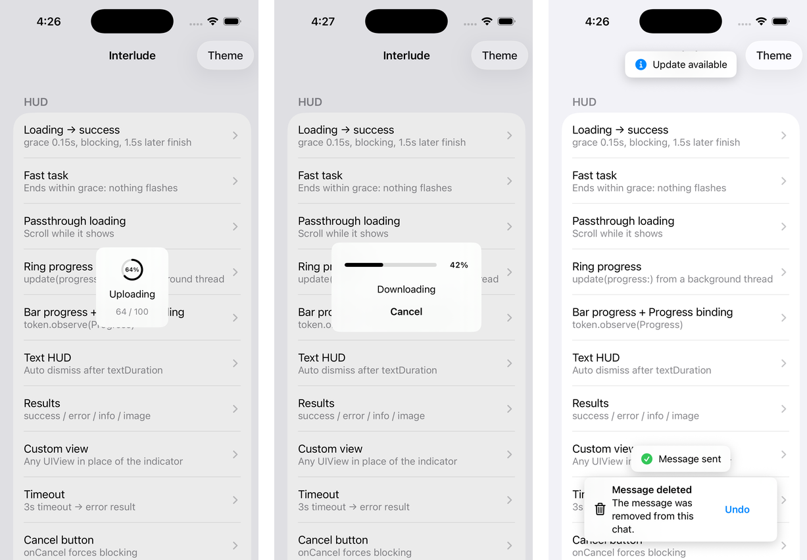

# Interlude

[](https://github.com/KahnLi-lyc/Interlude/actions/workflows/ci.yml)


**Interlude** is a token-driven HUD, progress and toast library for UIKit and SwiftUI, written in Swift 6 with strict concurrency.

It replaces the "show / hide singleton" model of `SVProgressHUD` and `MBProgressHUD` with a **token per task**, so two concurrent requests can never dismiss each other's feedback, and adds a full toast system inspired by `Toast-Swift` — sharing one window layer, one theme and one clock.

[简体中文](README.zh-Hans.md)



## Why Interlude

| | SVProgressHUD | MBProgressHUD | Toast-Swift | **Interlude** |
|---|---|---|---|---|
| Concurrency model | global show / dismiss | one view per call | one toast per view | **one `Token` per task, per host** |
| Grace time | ✔ | ✔ | – | ✔ (default 0.15 s, touches blocked even while pending) |
| Minimum visible time | ✔ | ✔ | – | ✔ |
| Results (✓ / ✕ / ⓘ / image) | ✔ | – | – | ✔ + haptics |
| Determinate progress | ring | ring, bar, annular | – | **ring, bar, `Foundation.Progress` binding** |
| Cancel button / timeout | – | – | – | ✔ |
| Toast | – | – | ✔ | ✔ stack / queue / replace, actions, keyboard avoidance |
| Local host (any `UIView`) | – | ✔ | ✔ | ✔ auto-cleanup on pop / release |
| async / await | – | – | – | ✔ `Interlude.run` |
| SwiftUI | – | – | – | ✔ modifiers + `.interludeHost()` |
| Swift 6 strict concurrency | – | – | – | ✔ |

## Installation

Interlude is distributed via Swift Package Manager only.

```swift
dependencies: [
    .package(url: "https://github.com/KahnLi-lyc/Interlude.git", from: "1.0.0")
]
```

Or in Xcode: **File ▸ Add Package Dependencies…** and paste the URL.

## Quick start

Configure the window once, typically in your scene delegate:

```swift
import Interlude

Interlude.configure { configuration in
    configuration.windowProvider = { [weak window] in window }
}
```

### Loading → result

```swift
let token = Interlude.loading("Saving…")
api.save { result in
    switch result {
    case .success: token.finish(.success("Saved"))
    case .failure(let error): token.finish(.error(error.localizedDescription))
    }
}
```

`update`, `dismiss` and `finish` are `nonisolated` — call them from any thread, a completion handler, or `deinit`.

### async / await

```swift
let user = try await Interlude.run("Signing in", success: "Welcome back") {
    try await auth.signIn(email, password)
}
```

Success dismisses the HUD (or shows `success`), a thrown error shows its `localizedDescription` as an error result, cancellation dismisses silently. Add `cancellable: true` for a cancel button that cancels the task.

### Progress

```swift
// Manual
let token = Interlude.progress(style: .bar, text: "Uploading")
token.update(progress: 0.42)

// Bound to Foundation.Progress
let token = Interlude.progress(uploadTask.progress, text: "Uploading")

// async with progress
try await Interlude.run("Compressing", style: .bar, totalUnitCount: 100) { progress in
    for chunk in chunks {
        try await compress(chunk)
        progress.completedUnitCount += 1
    }
}
```

### Text, results and custom views

```swift
Interlude.text("Copied to clipboard")
Interlude.show(.success("Done"))
Interlude.show(.image(UIImage(systemName: "heart.fill")!, "Liked"))
Interlude.custom(myAnimationView, text: "Thinking…")
```

### Toasts

```swift
Interlude.toast("Message sent", icon: .success)
Interlude.toast("Saved", animation: .zoom)

Interlude.toast(
    "The message was removed from this chat.",
    title: "Message deleted",
    icon: .system("trash"),
    action: .init(title: "Undo") { restore() },
    duration: .long
)

let handle = Interlude.toast("You're offline", icon: .warning, duration: .persistent)
handle.dismiss()
```

Policies (`stack(maximum:)`, `queue`, `replace`), positions (`top`, `center`, `bottom`, `point`), tap / swipe to dismiss and keyboard avoidance are configured through `Interlude.configure { $0.toast… }`. Per-call `animation:` overrides `theme.toast.animation` (default `.automatic`: slide at the edges, zoom in the centre).

### Local hosts

Attach to any view instead of the window. The overlay is removed automatically when the view is released or its view controller is popped or dismissed.

```swift
Interlude.loading("Loading card", on: cardView)
Interlude.toast("Only inside the card", on: cardView)
```

### Cancel, timeout and callbacks

```swift
Interlude.loading("Exporting", timeout: 30)
    .onCancel { exporter.cancel() }
    .onTimeout { log("export timed out") }
    .onDismiss { refresh() }
```

### SwiftUI

```swift
struct ContentView: View {
    @State private var isLoading = false
    @State private var progress: Double?
    @State private var toast: Interlude.Toast?

    var body: some View {
        Form { … }
            .interludeLoading(isPresented: $isLoading, text: "Loading")
            .interludeProgress($progress, style: .ring)
            .interludeToast($toast)
    }
}

// Scope HUDs and toasts to a container
CardView()
    .interludeLoading(isPresented: $isCardLoading)
    .interludeHost()
```

## Behaviour

- **Grace time** (`graceTime`, 0.15 s): tasks that finish sooner never flash a panel. Blocking HUDs intercept touches from the very first call.
- **Minimum visible time** (`minimumVisibleDuration`, 0.35 s): once visible, a panel stays long enough to be perceived.
- **Latest wins**: with several tokens on one host the most recent is rendered; dismissing it restores the previous one.
- **Results only when idle**: `finish(.success)` shows the result only when no other token is active on that host.
- **`dismissAll()`** removes everything immediately and invalidates every existing token — late `finish` calls are ignored.
- **Accessibility**: VoiceOver announcements, Dynamic Type, Reduce Motion (animations off) and Reduce Transparency (solid panels) are handled.
- **Localization**: en, zh-Hans, zh-Hant, ja, ko, fr, de, es, pt-BR. Override any string via `configuration.strings`.

## Theming

```swift
var theme = Interlude.Theme.dark
theme.background = .solid(.systemIndigo)
theme.cornerRadius = 20
theme.animation = .zoom
theme.toast.animation = .slide
theme.toast.background = .blur(.systemThinMaterial)
theme.progressFill = .gradient
theme.progressGradient = [.white, .systemCyan]
Interlude.theme = theme

// Or per call
Interlude.loading("Paying", theme: .light)
```

Presets: `.automatic` (follows system appearance), `.dark`, `.light`.

## Migrating

| From | To |
|---|---|
| `SVProgressHUD.show()` / `dismiss()` | `let token = Interlude.loading()` / `token.dismiss()` |
| `SVProgressHUD.showSuccess(withStatus:)` | `token.finish(.success("…"))` or `Interlude.show(.success("…"))` |
| `MBProgressHUD.showAdded(to: view, animated:)` | `Interlude.loading(on: view)` |
| `hud.progress = 0.5` | `token.update(progress: 0.5)` |
| `view.makeToast("…")` | `Interlude.toast("…", on: view)` |

## Requirements

- iOS 15.0+
- Swift 6.0 / Xcode 16+

## Example

Open `Example/InterludeExample.xcodeproj` (regenerate with `xcodegen` from `Example/project.yml`). Every public API has a row in the demo list; `--autoplay <scenario>` launches straight into a scenario for screenshots.

### Inspecting with Lookin

The Example app links [LookinServer 1.2.8](https://github.com/QMUI/LookinServer/) as a development-only dependency. LookinServer's implementation is enabled only in Debug builds, so no explicit startup code is required and Release builds do not launch the inspection server. The Interlude library itself remains dependency-free.

Build and run the [MCP-enabled Lookin branch](https://github.com/FeliksLv01/Lookin/tree/feat/lookin_mcp), then connect an MCP client to `http://127.0.0.1:47199/mcp`. Launch the Example with `--autoplay loading` to inspect a HUD or `--autoplay toast` to inspect three stacked toasts.

## Contributing

See [AGENTS.md](AGENTS.md) for the coding conventions and [DESIGN.md](DESIGN.md) for the design specification. Run `swiftformat .`, `swiftlint --strict` and the test suite before opening a pull request.

## License

MIT — see [LICENSE](LICENSE).
